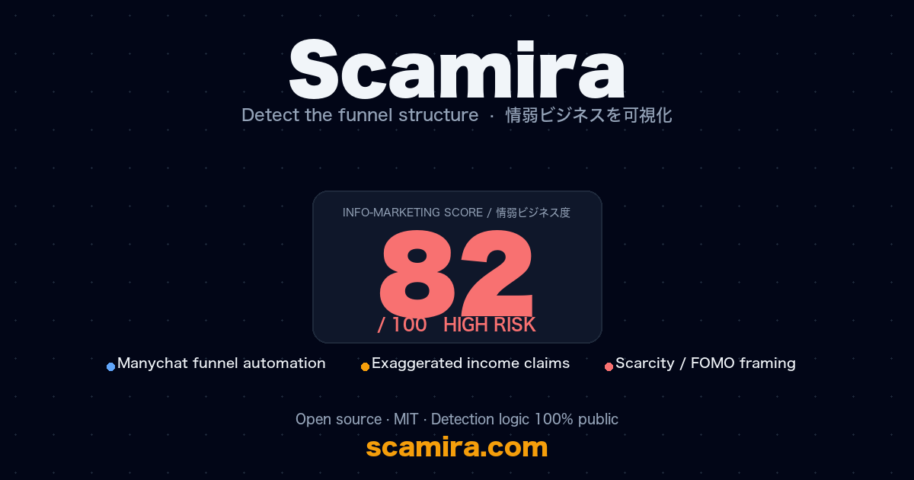

# Scamira

[English](README.md) · **日本語**

> SNSの副業系発信に含まれる「情弱ビジネス・パターン」を構造的に検出するオープンソースツール

## 🚀 ライブデモ

**https://scamira.com**



気になるInstagramリールやX投稿のキャプションをペーストするだけで、誘導の構造・パターン・スコアを可視化します。**日本語・英語の両方**に対応。

## なぜ作ったか

SNSには、情報格差を利用して初心者から教材費を巻き上げる「情弱ビジネス」が氾濫しています。Manychatによる自動DM、根拠不明な収入実績、希少性アピール、PLR/MRR再販ビジネス——これらは見た目こそ違えど、構造的に共通したパターンを持っています。

Scamiraはその構造を**透明な検出ロジック**で可視化し、誰もが「なぜこの投稿は怪しいのか」を自分の言葉で理解できるようにすることを目指します。

「情弱ビジネス」を駆逐したいわけではありません。判断材料を、本来買い手側に提供されるべき情報を、提供したいだけです。

## 何ができるか（v0.2）

- SNS投稿のテキストをペースト → AI分析で「情弱ビジネス度」を0〜100でスコアリング
- 検出されたパターンを **強・中・弱** のシグナル区分と根拠引用付きで表示
- 検出ロジック・プロンプトを **完全公開**
- **共有可能な分析URL** （`scamira.com/a/:id` で90日保存・再表示）
- **日本語 / 英語 UI**（言語スイッチャー）
- **累計分析数の表示**

## 設計方針

- **検出ロジックは完全公開**：[`src/prompts.ts`](src/prompts.ts) と [`docs/methodology.md`](docs/methodology.md) を参照
- **個人攻撃しない**：投稿の構造のみ分析、発信者の人格は評価しない
- **断定しない**：「詐欺」「悪質」と判定するものではなく、パターンの可視化が目的
- **異議申立て歓迎**：誤判定があれば Issue または PR で指摘してください

## 技術スタック

- **Frontend**: TailwindCSS (CDN), Vanilla JS
- **Backend**: Cloudflare Workers (TypeScript)
- **LLM**: Anthropic Claude Haiku 4.5
- **Hosting**: Cloudflare Workers + Static Assets

## ローカル開発

```bash
git clone https://github.com/guernika54/scamira.git
cd scamira

npm install

# Anthropic API キーを設定
cp .dev.vars.example .dev.vars
# .dev.vars を編集して ANTHROPIC_API_KEY を入れる

npm run dev
# → http://localhost:8787 で起動
```

## サポート

Scamira は **無料・オープンソース** で運営されています。インフラ・LLM API・ドメイン更新の費用は、現在は個人で負担しています。

開発を応援してくださる方は：

- ☕ **[Buy Me a Coffee](https://buymeacoffee.com/k54kbusineu)** — 単発の少額支援
- ⭐ **GitHub Star** — このリポジトリにスターをつけてください
- 🐛 **Issue / PR** — バグ報告・機能提案・検出パターンの追加歓迎
- 📣 **シェア** — 周りに Scamira を紹介してください

## ライセンス

[MIT](LICENSE)

## コントリビュート

Issue / PR 大歓迎。情弱ビジネスの新しいパターンを見つけたら、[`src/prompts.ts`](src/prompts.ts) の検出ロジック改善のために共有してください。
